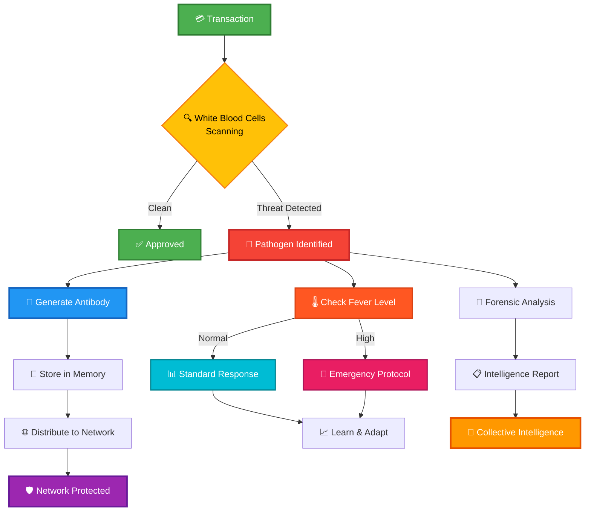
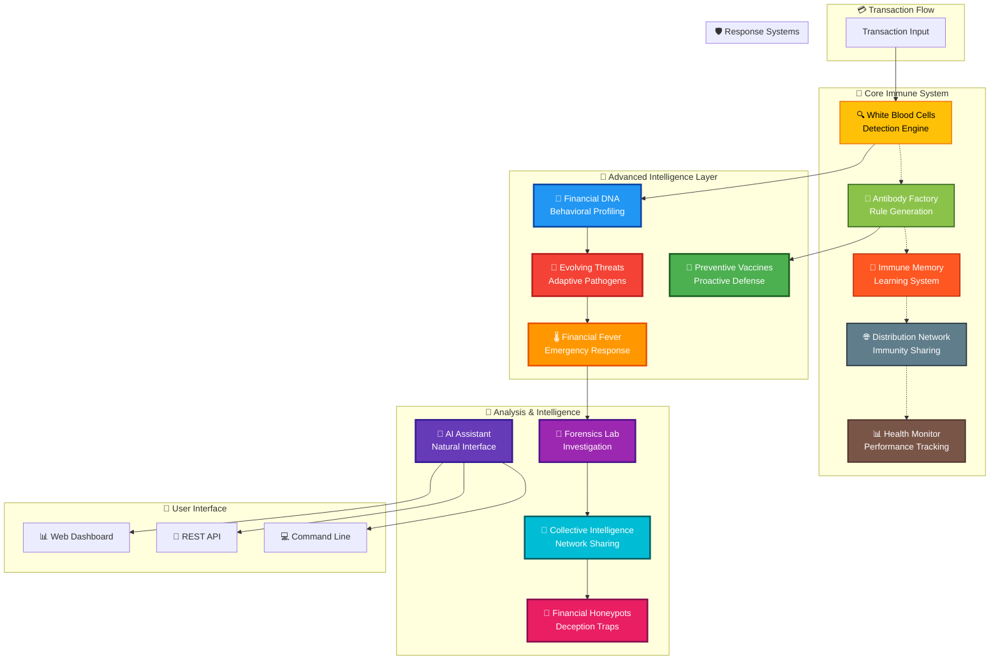
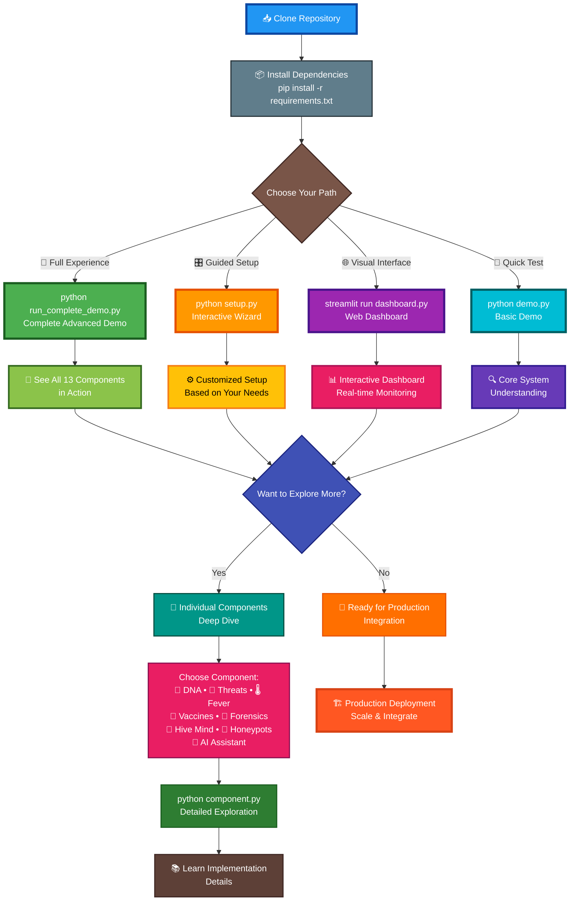
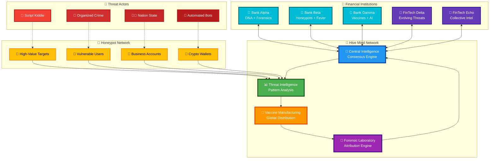

# 🦠 Financial Immune System

> *A revolutionary fraud detection system inspired by the human immune system that detects financial anomalies like "viruses," generates "antibodies" (security rules), and distributes immunity across the entire financial network.*

## 🌟 Overview 

The Financial Immune System is a sophisticated, biologically-inspired fraud detection and prevention system that mimics the human immune system's ability to:

- **Detect Pathogens**: Identify financial threats and anomalies in real-time
- **Generate Antibodies**: Create adaptive security rules to combat specific threats
- **Build Immunity**: Learn from encounters and strengthen defenses over time
- **Distribute Protection**: Share immunity across the entire financial network

## 🎯 System Flow Overview



## 🧬 System Architecture

### Core Components

1. **White Blood Cells (Detection Engine)**
   - 8 specialized detection algorithms
   - Real-time transaction scanning
   - Pattern recognition and anomaly detection

2. **Antibody Factory (Rule Generation)**
   - Automatic security rule creation
   - Threat-specific response mechanisms
   - Adaptive rule optimization

3. **Immune Memory System**
   - Long-term threat memory
   - Adaptive learning capabilities
   - Performance-based rule evolution

4. **Distribution Network**
   - Network-wide immunity sharing
   - Real-time synchronization
   - Distributed protection deployment

5. **Health Monitor**
   - System performance tracking
   - Alert generation
   - Optimization recommendations

### 🚀 Advanced Components

6. **🧬 Financial DNA System**
   - Unique behavioral fingerprints for each user
   - Genetic-style evolution and adaptation
   - Identity theft detection through DNA changes
   - Cross-user similarity analysis for fraud detection

7. **🦠 Evolving Threats System**
   - Adaptive financial viruses that learn and evolve
   - Resistance development to antibodies
   - Camouflage and evasion techniques
   - Threat ecosystem with natural selection

8. **🌡️ Financial Fever System**
   - System-wide fever response to coordinated attacks
   - Temperature-based sensitivity scaling
   - Emergency protocol activation
   - Network-wide immune response coordination

9. **💉 Preventive Vaccines System**
   - Proactive immunization based on threat intelligence
   - Vaccine research and development pipeline
   - Mass vaccination campaigns
   - Quality control and effectiveness testing

10. **🔬 Forensics Laboratory**
    - Post-attack investigation and analysis
    - Evidence collection and chain of custody
    - Attack reconstruction and attribution
    - Comprehensive threat intelligence generation

11. **🧠 Collective Intelligence (Hive Mind)**
    - Multi-institutional threat intelligence sharing
    - Privacy-preserving data anonymization
    - Consensus-based validation
    - Distributed neural threat correlation

12. **🍯 Financial Honeypots System**
    - Decoy accounts to attract and study attackers
    - Multi-layered deception techniques
    - Attacker profiling and behavioral analysis
    - Intelligence gathering in controlled environments

13. **🤖 AI Conversational Assistant**
    - Natural language system interaction
    - Context-aware explanations and guidance
    - Multi-modal communication (technical/business/casual)
    - Real-time system integration and insights

## 🏗️ Advanced System Architecture



## 🦠 Detected Threat Types

The system can detect and respond to various financial "pathogens":

- **Unusual Transaction Patterns**: Statistical anomalies in spending behavior
- **Velocity Anomalies**: Rapid-fire transaction attacks
- **Geographic Anomalies**: Transactions from unusual locations
- **Behavioral Deviations**: Changes in user behavior patterns
- **Account Takeover**: Suspicious account access patterns
- **Money Laundering**: Structuring and suspicious fund movements
- **Synthetic Identity Fraud**: Fake identity detection
- **Card Testing**: Automated card validation attacks

## 🔄 Threat Evolution Lifecycle

```mermaid
graph LR
    subgraph "🦠 Threat Evolution"
        A[Initial Threat] --> B[🔍 Detection]
        B --> C[💉 Antibody Created]
        C --> D[🌐 Network Distribution]
        D --> E[🛡️ Protection Active]
        
        E --> F{Threat Adapts?}
        F -->|Yes| G[🧬 Mutation]
        F -->|No| H[✅ Threat Neutralized]
        
        G --> I[🦠 Evolved Threat]
        I --> J[🔍 Re-Detection]
        J --> K[💉 New Antibody]
        K --> L[🧠 Memory Update]
        L --> D
    end
    
    subgraph "🌡️ Fever Response"
        M[Multiple Threats] --> N{Fever Threshold?}
        N -->|Yes| O[🌡️ System Fever]
        O --> P[🚨 Emergency Protocols]
        P --> Q[🔒 Enhanced Security]
        Q --> R[❄️ Cool Down]
        R --> S[📊 Normal Operations]
    end
    
    subgraph "🧬 DNA Learning"
        T[User Behavior] --> U[🧬 DNA Analysis]
        U --> V[📊 Pattern Recognition]
        V --> W{Anomaly?}
        W -->|Yes| X[🚨 Alert]
        W -->|No| Y[✅ Normal]
        X --> Z[🔍 Investigation]
        Y --> AA[📈 Profile Update]
    end
    
    style A fill:#FF5722,stroke:#D84315,stroke-width:3px,color:#fff
    style G fill:#F44336,stroke:#C62828,stroke-width:3px,color:#fff
    style I fill:#D32F2F,stroke:#B71C1C,stroke-width:3px,color:#fff
    style O fill:#FF9800,stroke:#E65100,stroke-width:3px,color:#fff
    style P fill:#F44336,stroke:#B71C1C,stroke-width:3px,color:#fff
    style U fill:#2196F3,stroke:#1565C0,stroke-width:3px,color:#fff
    style V fill:#03A9F4,stroke:#0277BD,stroke-width:3px,color:#fff
    style B fill:#4CAF50,stroke:#2E7D32,stroke-width:2px,color:#fff
    style C fill:#8BC34A,stroke:#558B2F,stroke-width:2px,color:#fff
    style D fill:#FFC107,stroke:#F57F17,stroke-width:2px,color:#000
    style E fill:#9C27B0,stroke:#6A1B9A,stroke-width:2px,color:#fff
    style H fill:#4CAF50,stroke:#2E7D32,stroke-width:2px,color:#fff
    style M fill:#FF9800,stroke:#E65100,stroke-width:2px,color:#fff
    style N fill:#FF5722,stroke:#D84315,stroke-width:2px,color:#fff
    style T fill:#673AB7,stroke:#311B92,stroke-width:2px,color:#fff
    style W fill:#E91E63,stroke:#AD1457,stroke-width:2px,color:#fff
    style X fill:#F44336,stroke:#C62828,stroke-width:2px,color:#fff
    style Y fill:#4CAF50,stroke:#2E7D32,stroke-width:2px,color:#fff
```



## 💉 Antibody Types

The system generates specialized antibodies (security rules) for each threat:

- **Pattern Guards**: Amount and behavior threshold monitors
- **Velocity Limiters**: Transaction frequency controls
- **Geo Guards**: Location-based verification requirements
- **Behavior Monitors**: New merchant/location authentication
- **Account Shields**: Multi-factor authentication triggers
- **AML Guards**: Anti-money laundering monitoring
- **Identity Verifiers**: Enhanced KYC requirements
- **Card Protectors**: Card security mechanisms

## 🚀 Quick Start

### Installation

1. **Clone the repository**:
   ```bash
   git clone <repository-url>
   cd FRAUDPLD
   ```

2. **Install dependencies**:
   ```bash
   pip install -r requirements.txt
   ```

3. **Quick Start Options**:

   **🚀 Complete Advanced System Demo**:
   ```bash
   python run_complete_demo.py
   ```

   **🎛️ Interactive Setup Wizard**:
   ```bash
   python setup.py
   ```

   **🌐 Web Dashboard**:
   ```bash
   streamlit run dashboard.py
   ```

   **🧪 Basic System Demo**:
   ```bash
   python demo.py
   ```

4. **Individual Component Demos**:
   ```bash
   python financial_dna.py           # DNA System
   python evolving_threats.py        # Evolving Threats
   python financial_fever.py         # Fever System
   python preventive_vaccines.py     # Vaccines
   python forensics_lab.py           # Forensics
   python collective_intelligence.py # Hive Mind
   python financial_honeypots.py     # Honeypots
   python ai_assistant.py            # AI Assistant
   ```

## 🚀 Getting Started Flowchart



### Basic Usage

**Core System:**
```python
from immune_system_app import FinancialImmuneSystem, create_sample_transaction

# Initialize the immune system
immune_system = FinancialImmuneSystem()
await immune_system.start_system()

# Process a transaction
transaction = await create_sample_transaction(
    user_id="user_123",
    amount=1500.00,
    location="New York",
    merchant="Amazon"
)

result = await immune_system.process_transaction(transaction)
print(f"Status: {result['status']}, Threats: {result['threats_detected']}")
```

**Advanced Integrated System:**
```python
from advanced_immune_system import AdvancedFinancialImmuneSystem

# Initialize advanced system with all components
advanced_system = AdvancedFinancialImmuneSystem("my_institution")
await advanced_system.start_advanced_system()

# Process transaction through advanced pipeline
result = await advanced_system.process_advanced_transaction(transaction)

# Advanced results include:
# - DNA behavioral analysis
# - Evolving threat tracking
# - Fever system response
# - Network intelligence correlation
# - Forensic evidence collection
# - Honeypot interaction detection

print(f"Advanced Analysis: {result['advanced_analysis']}")

# Chat with AI assistant
response = await advanced_system.chat_with_ai_assistant(
    "What just happened with that transaction?"
)
print(f"AI: {response['response']}")
```

## 🌐 Collective Intelligence Network



## 📊 Dashboard Features

The real-time dashboard provides:

- **Live System Metrics**: Transaction processing, threat detection rates
- **Threat Visualization**: Interactive charts and timelines
- **Network Topology**: Visual representation of immune network
- **Antibody Evolution**: Tracking of adaptive security rules
- **Transaction Logs**: Detailed processing history

### Dashboard Screenshots

*Launch the dashboard to see the beautiful, real-time visualizations!*

## 🔬 Advanced Features

### Adaptive Learning

The system continuously learns and adapts:

```python
# Automatic antibody adaptation based on performance
performance_data = {
    'success_rate': 0.85,
    'false_positive_rate': 0.12
}

adapted_antibody = await immune_memory.adapt_antibody(antibody, performance_data)
```

### Network Distribution

Immunity is automatically distributed across network nodes:

```python
# Register a new network node
await distribution_network.register_node("payment_gateway_3", {
    'type': 'gateway',
    'location': 'eu_west',
    'capabilities': ['real_time_processing']
})

# Distribute antibody to all nodes
await distribution_network.distribute_antibody(new_antibody)
```

### Custom Threat Detection

Add custom detection algorithms:

```python
async def detect_custom_pattern(self, transaction):
    # Custom detection logic
    if custom_condition_met(transaction):
        return FinancialPathogen(
            anomaly_type=AnomalyType.CUSTOM_PATTERN,
            threat_level=ThreatLevel.HIGH,
            # ... other parameters
        )
    return None

# Register custom detector
white_blood_cells.detection_algorithms[AnomalyType.CUSTOM_PATTERN] = detect_custom_pattern
```

## 📈 Performance Metrics

The system tracks comprehensive performance metrics:

- **Detection Rate**: Percentage of actual threats detected
- **False Positive Rate**: Percentage of legitimate transactions flagged
- **Response Time**: Average processing time per transaction
- **Network Health**: Overall system network status
- **Adaptation Rate**: Speed of learning and improvement

## 🛡️ Security Features

### Multi-layered Protection

1. **Real-time Scanning**: Every transaction is scanned by multiple detection engines
2. **Adaptive Responses**: Responses scale with threat severity and system confidence
3. **Memory-based Immunity**: Previous encounters strengthen future defenses
4. **Network-wide Protection**: Threats detected anywhere protect the entire network

### Response Actions

The system can take various protective actions:

- **Transaction Blocking**: Immediate transaction denial
- **Step-up Authentication**: Additional verification requirements
- **Account Monitoring**: Enhanced surveillance periods
- **Manual Review Flagging**: Human analyst involvement
- **Regulatory Reporting**: Automatic compliance reporting

## 🔧 Configuration

### System Configuration

```python
immune_system.config = {
    'auto_generate_antibodies': True,
    'auto_distribute_antibodies': True,
    'memory_adaptation_enabled': True,
    'real_time_monitoring': True,
    'max_concurrent_scans': 100
}
```

### Alert Thresholds

```python
health_monitor.alert_thresholds = {
    'detection_rate': 0.8,
    'false_positive_rate': 0.1,
    'response_time': 5.0,
    'network_health': 0.9
}
```

## 🧪 Testing and Simulation

### Threat Simulation

The system includes comprehensive threat simulation capabilities:

```python
# Simulate velocity attack
await simulate_specific_threat("velocity")

# Simulate geographic anomaly
await simulate_specific_threat("geographic")

# Simulate account takeover
await simulate_specific_threat("behavioral")
```

### Performance Testing

```python
# Load testing
for i in range(1000):
    transaction = await create_sample_transaction()
    result = await immune_system.process_transaction(transaction)
    
# Analyze performance
status = await immune_system.get_system_status()
print(f"Average response time: {status['avg_response_time']:.3f}s")
```

## 📁 Project Structure

```
FRAUDPLD/
├── 🧬 Core System Files
│   ├── financial_immune_system.py    # Base immune system components
│   ├── immune_system_app.py          # Main application orchestrator
│   ├── dashboard.py                  # Web dashboard interface
│   └── demo.py                       # Basic system demonstration
│
├── 🚀 Advanced System Files
│   ├── financial_dna.py              # DNA behavioral profiling
│   ├── evolving_threats.py           # Adaptive threat evolution
│   ├── financial_fever.py            # System fever response
│   ├── preventive_vaccines.py        # Proactive immunization
│   ├── forensics_lab.py              # Post-attack investigation
│   ├── collective_intelligence.py    # Network intelligence sharing
│   ├── financial_honeypots.py        # Attacker honeypot traps
│   ├── ai_assistant.py               # Conversational AI interface
│   └── advanced_immune_system.py     # Integrated advanced system
│
├── 🛠️ Utility Files
│   ├── setup.py                      # Interactive setup wizard
│   ├── test_system.py                # Comprehensive test suite
│   ├── run_complete_demo.py          # Complete system demonstration
│   ├── requirements.txt              # Python dependencies
│   └── README.md                     # This documentation
```

## 📚 API Reference

### Core Classes

- `FinancialImmuneSystem`: Main orchestrator class
- `AdvancedFinancialImmuneSystem`: Advanced integrated system
- `WhiteBloodCell`: Detection engine
- `AntibodyFactory`: Rule generation system
- `ImmuneMemorySystem`: Learning and adaptation
- `ImmunityDistributionNetwork`: Network management
- `SystemHealthMonitor`: Performance monitoring

### Advanced Classes

- `FinancialDNA`: User behavioral profiling
- `EvolvingThreat`: Adaptive threat entities
- `FinancialFever`: System fever response
- `VaccineResearchLab`: Preventive vaccine development
- `ForensicAnalyzer`: Post-attack investigation
- `CollectiveIntelligence`: Network intelligence sharing
- `FinancialHoneypot`: Attacker honeypot system
- `FinancialImmuneAssistant`: AI conversational interface

### Data Structures

- `Transaction`: Financial transaction data
- `FinancialPathogen`: Detected threat information
- `Antibody`: Security rule definition
- `ImmuneMemory`: Long-term system memory
- `SharedIntelligence`: Network-shared threat data
- `AttackInteraction`: Honeypot interaction record
- `ForensicEvidence`: Investigation evidence

## 🚀 Production Deployment

### Scalability Considerations

1. **Horizontal Scaling**: Deploy multiple immune system instances
2. **Database Integration**: Use persistent storage for memory and logs
3. **Message Queues**: Implement async processing for high throughput
4. **Caching**: Use Redis for fast antibody lookups
5. **Monitoring**: Integrate with existing monitoring infrastructure

### Integration Examples

```python
# FastAPI integration
from fastapi import FastAPI
app = FastAPI()

@app.post("/process-transaction")
async def process_transaction(transaction_data: dict):
    transaction = Transaction(**transaction_data)
    result = await immune_system.process_transaction(transaction)
    return result
```

## 🤝 Contributing

We welcome contributions! Please see our contributing guidelines for:

- Code style requirements
- Testing procedures
- Documentation standards
- Pull request process

## 📄 License

This project is licensed under the MIT License - see the LICENSE file for details.

## 🎯 Key Features Summary

### 🧬 **Biological Inspiration**
- **DNA Profiling**: Unique behavioral fingerprints for each user
- **Evolving Threats**: Pathogens that adapt and develop resistance
- **Fever Response**: System-wide emergency response to coordinated attacks
- **Vaccines**: Proactive immunization against known threat patterns
- **Immune Memory**: Long-term learning and adaptation

### 🤖 **Advanced Intelligence**
- **Collective Intelligence**: Multi-institutional threat sharing network
- **Forensic Analysis**: Comprehensive post-attack investigation
- **Honeypot Traps**: Deception-based intelligence gathering
- **AI Assistant**: Natural language system interaction
- **Predictive Analytics**: Threat evolution and pattern prediction

### 🛡️ **Enterprise Ready**
- **Real-time Processing**: Sub-second transaction analysis
- **Scalable Architecture**: Distributed processing and storage
- **Privacy Preserving**: Advanced anonymization techniques
- **Compliance Ready**: Audit trails and regulatory reporting
- **Integration APIs**: Easy integration with existing systems

## 🧪 Testing and Validation

The system includes comprehensive testing capabilities:

```bash
# Run all system tests
python test_system.py

# Test individual components
python financial_dna.py --test
python evolving_threats.py --test
python financial_fever.py --test

# Performance benchmarking
python setup.py --benchmark

# Security validation
python setup.py --security-test
```

## 🌟 What Makes This Special

1. **First-of-its-kind**: True biological immune system implementation for finance
2. **Adaptive Learning**: System evolves and improves automatically
3. **Network Effect**: Gets stronger as more institutions join
4. **Proactive Defense**: Prevents attacks before they happen
5. **Human-Friendly**: AI assistant explains everything in plain language
6. **Research-Grade**: Suitable for academic research and commercial deployment

## 🙏 Acknowledgments

- Inspired by the remarkable efficiency of biological immune systems
- Built with modern Python async/await patterns
- Visualization powered by Plotly and Streamlit
- Advanced AI powered by natural language processing
- Special thanks to the fraud detection and cybersecurity communities
- Biological analogies inspired by immunology research

## 📞 Support

For questions, issues, or feature requests:

- **Quick Start**: Run `python setup.py` for guided setup
- **Documentation**: All files include comprehensive docstrings
- **Examples**: Each component includes demo functions
- **AI Help**: Use the AI assistant for real-time guidance
- **Community**: Share experiences and improvements

## 🚀 Future Roadmap

- **Quantum-Resistant Security**: Post-quantum cryptography integration
- **Blockchain Integration**: Immutable threat intelligence ledger
- **IoT Device Protection**: Extend to IoT financial devices
- **Regulatory AI**: Automated compliance and reporting
- **Global Threat Network**: Worldwide financial immune system

---

**Financial Immune System** - *The future of financial security, inspired by 3.8 billion years of evolution.* 🦠💰🛡️
